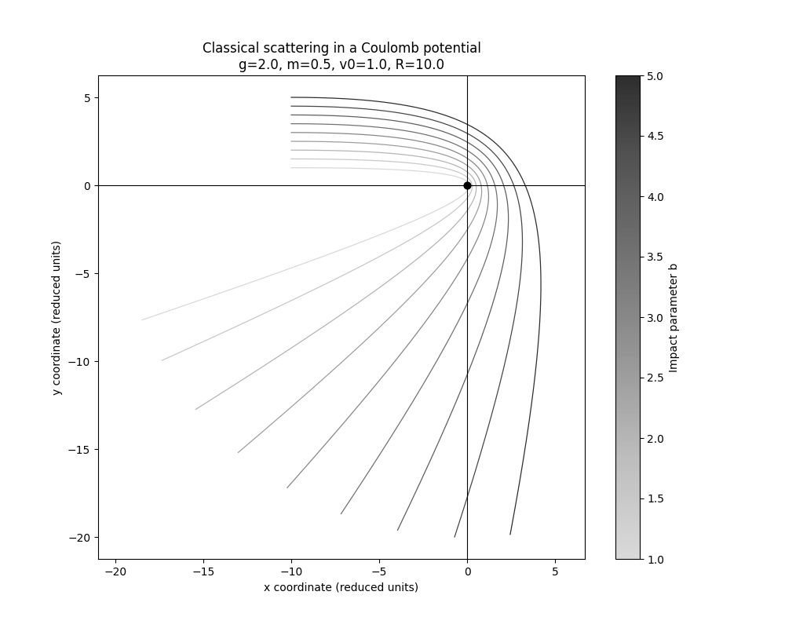

# Scattering-Particles

A Python-based classical mechanics simulation framework for studying particle scattering in central force fields, with a focus on Coulomb potential interactions.

## Overview

This project simulates the classical scattering of particles in a central Coulomb potential. The simulation tracks particle trajectories as they approach and deflect around a central force field, demonstrating fundamental concepts in classical mechanics such as:

- **Central force motion** with conservation of angular momentum
- **Rutherford scattering** trajectories
- **Impact parameter** dependence on scattering angle
- **Energy and momentum conservation** in classical systems

All quantities are expressed in **reduced (dimensionless) units**, where only dimensionless ratios like `g / (m v₀² b)` govern the dynamics.

## Features

- ✨ **Modular architecture** with separate classes for particles, potentials, integrators, and visualization
- 📊 **Static trajectory plotting** with grayscale color-coding by impact parameter
- 🎬 **Animated visualization** showing real-time particle motion with optional velocity vectors
- 🔬 **Extensible potential system** - easily add new force fields beyond Coulomb
- 📈 **Energy conservation monitoring** during time evolution
- 🎨 **Publication-ready plots** with customizable styling and colormaps

## Project Structure

```
Scattering-Particles/
├── particle.py      # Particle class: mass, position, velocity, trajectory storage
├── potential.py     # Potential base class and CoulombPotential implementation
├── integrator.py    # Time integration using Euler method with force evaluation
├── simulation.py    # Main simulation loop and entry point
├── results.py       # Visualization: static plots and animations
└── README.md        # This file
```

## Requirements

- Python 3.8+
- NumPy
- Matplotlib

Install dependencies:

```bash
pip install numpy matplotlib
```

## Quick Start

Run the default simulation:

```bash
python simulation.py
```

This will:
1. Initialize 9 particles with different impact parameters (1.0 to 5.0)
2. Simulate their trajectories in a Coulomb potential (g=2.0)
3. Display a static plot showing all trajectories color-coded by impact parameter

## Usage Examples

### Basic Simulation

```python
from particle import Particle
from potential import CoulombPotential
from integrator import Integrator
from simulation import Simulation
from results import Results

# Setup parameters (reduced units)
g = 2.0          # coupling constant (potential strength)
m = 0.5          # particle mass
v0 = 1.0         # initial velocity
R = 10.0         # initial distance from center
b_values = [1.0, 2.0, 3.0, 4.0, 5.0]  # impact parameters

# Create potential and integrator
potential = CoulombPotential(g=g)
integrator = Integrator(dt=0.01, potential=potential)

# Initialize particles
particles = []
for b in b_values:
    p = Particle(
        masse=m,
        position=[-R, b],      # Start far left
        velocity=[v0, 0.0],    # Move to the right
        trajectories=[],
        velocities=[]
    )
    particles.append(p)

# Run simulation
simulation = Simulation(particles, integrator, t_max=100.0)
simulation.run(R_exit=20.0)  # Stop tracking when particles exit

# Visualize results
results = Results()
hyperparameters = {"g": g, "m": m, "v0": v0, "R": R}
results.plot_trajectories(particles, b_values, hyperparameters)
```

## Physics Background

### Reduced Units

All physical quantities are dimensionless:

- **r**: position (reduced length units)
- **v**: velocity (reduced length / time)
- **m**: mass (reduced mass, reference m=1)
- **t**: time (reduced time)
- **g**: coupling constant (controls interaction strength)

### Coulomb Potential

The force from a Coulomb potential is:

$$\mathbf{F}(\mathbf{r}) = -\frac{g \mathbf{r}}{|\mathbf{r}|^3}$$

This produces repulsive (g > 0) or attractive (g < 0) interactions.

### Conservation Laws

The integrator tracks:
- **Angular momentum**: L = |r × mv|
- **Effective potential**: V_eff = L²/(2mr²) + g/r
- **Total energy**: E = ½mv² + V_eff

## Customization

### Adding New Potentials

### Adjusting Time Step

Smaller time steps improve accuracy but increase computation time:

```python
integrator = Integrator(dt=0.001, potential=potential)  # Higher precision
```

### Custom Color Schemes

Modify the colormap in `results.py`:

```python
cmap = plt.get_cmap("viridis")  # Or: "plasma", "inferno", "coolwarm"
```

## Output

### Static Plot
- Grayscale trajectories with darker shades for larger impact parameters
- Central potential marked with black dot
- Coordinate axes at origin
- Colorbar showing impact parameter scale
- Hyperparameters displayed in title



## Notes

- Numerical values have no SI unit significance
- Dynamics are governed by dimensionless ratios

## License

MIT License - feel free to use and modify for educational or research purposes.

## Author

Louis Lejaille - Classical mechanics simulation framework